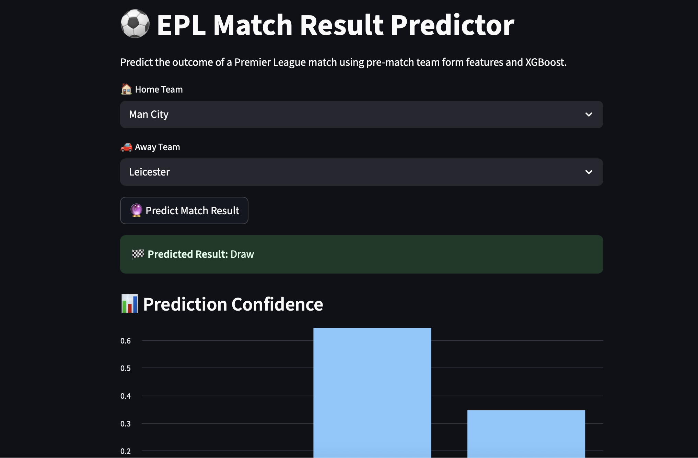

# Premier League Match Outcome Predictor ⚽📊

This project uses machine learning (XGBoost) and rolling performance metrics to predict match outcomes (Home Win, Draw, Away Win) in the English Premier League.

## 🔧 Features
- Trains on match result data (2022–23 season)
- Uses recent form (goals, points, etc.) for each team
- Predicts match outcome based on selected teams
- Interactive Streamlit dashboard for real-time prediction

## 🚀 Technologies
- Python (Pandas, XGBoost, Scikit-learn)
- Streamlit for UI
- Jupyter Notebook for development
- Data from Kaggle EPL datasets

## 📊 Demo Screenshot


## 📂 Project Structure
```
├── data/                # Model + team form data
├── scripts/             # Streamlit app + training notebook
├── requirements.txt     # Python dependencies
└── README.md
```

## 🧠 How It Works
- Rolling averages (past 5 games) are calculated per team
- These stats are used as model features
- Model is trained with multi-class classification (Home Win, Draw, Away Win)

## ▶️ Run Locally

1. Clone this repo and navigate to it:
   ```
   git clone https://github.com/Latchenvan/premier-league-match-predictor.git
   cd premier-league-match-predictor
   ```

2. Create and activate a virtual environment (optional but recommended):
   ```
   python3 -m venv venv
   source venv/bin/activate
   ```

3. Install dependencies:
   ```
   pip install -r requirements.txt
   ```

4. Launch the Streamlit app:
   ```
   streamlit run scripts/streamlit_app.py
   ```

## 📈 Model Accuracy
- XGBoost CV Accuracy: **71.7%**
- Random Forest CV Accuracy: **71.7%**

## 👤 Author
Tobe Gabriel Ejike  
[GitHub Profile](https://github.com/Latchenvan)
